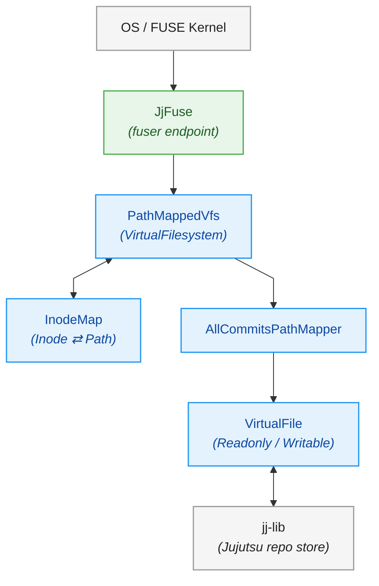

<div class="title-block" style="text-align: center;" align="center">

# `jjfsd` — a virtual file system for Jujutsu

A FUSE-based Virtual File System (VFS) proof-of-concept for [Jujutsu (`jj`)](https://github.com/jj-vcs/jj) repositories built with Rust.

[](LICENSE)
<br/>

**[Architecture & Design](docs/architecture.md) &nbsp;&nbsp;&bull;&nbsp;&nbsp;**
**[Contributing](docs/contributing.md) &nbsp;&nbsp;&bull;&nbsp;&nbsp;**
**[Code of Conduct](docs/code-of-conduct.md)**

</div>

---

> [!WARNING]
> **Experimental Proof-of-Concept**
> This project provides a proof-of-concept or reference implementation of a Virtual File System (VFS) for jj. No guarantee of completeness, performance, or API stability is promised at this time.

---

## Introduction

[Jujutsu (`jj`)](https://github.com/jj-vcs/jj) is a Git-compatible distributed version control system featuring a commit-centric workflow, first-class conflicts, and automatic working-copy tracking.

`jjfsd` mounts a Jujutsu repository directly onto the local filesystem via FUSE. Rather than switching branches or checking out different commits on disk, `jjfsd` exposes your repository as a live, navigable filesystem:

- **Browse any commit**: Every historical commit snapshot is accessible as a read-only directory tree under `/commits/<commit-id>/`.
- **Live workspaces**: Files inside `/workspaces/<name>/` (e.g. `default`) can be edited, created, or deleted directly. Every filesystem change automatically updates the working-copy commit in Jujutsu in real time.

---

## Mount Layout

When mounted, `jjfsd` presents the following top-level directory structure:

```text
<mountpoint>/
├── commits/                    # Read-only trees for all commits in the repository
│   ├── <commit-id-1>/
│   │   ├── src/
│   │   └── Cargo.toml
│   └── <commit-id-2>/
│       └── ...
└── workspaces/                 # Read-write working copies
    └── default/                # Changes auto-committed into jj in real time!
        ├── src/
        └── Cargo.toml
```

---

## Quickstart

### Prerequisites

- **Linux** with FUSE3 installed:
  - Debian/Ubuntu: `sudo apt-get install -y libfuse3-dev fuse3 pkg-config`
  - Fedora: `sudo dnf install -y fuse3-devel fuse3 pkgconf-pkg-config`
  - Arch: `sudo pacman -S fuse3 pkgconf`
- **Rust 2024 Edition** (Rust 1.85+ recommended).
- An existing Jujutsu (`jj`) repository.

### Building & Running

1. **Build the daemon**:
   ```bash
   cargo build --release
   ```

2. **Mount your repository**:
   ```bash
   # Create a mountpoint directory
   mkdir -p /tmp/jj-mount

   # Start the daemon
   ./target/release/jjfsd /tmp/jj-mount /path/to/my-jj-repo
   ```

3. **Browse commits** (in another terminal):
   ```bash
   # Inspect a historical commit
   ls -la /tmp/jj-mount/commits/<commit-id>/
   ```

5. **Unmount**:
   Press `Ctrl+C` in the daemon terminal, or run:
   ```bash
   fusermount3 -u /tmp/jj-mount
   ```

### Logging

Log verbosity can be adjusted using the standard `RUST_LOG` environment variable:
```bash
RUST_LOG=jjfsd=debug ./target/release/jjfsd /tmp/jj-mount /path/to/my-jj-repo
```

---

## Architecture Summary

`jjfsd` is organized in modular layers:



- **`JjFuse` (Endpoint Layer)**: Implements `fuser::Filesystem`, maps FUSE syscalls (`lookup`, `getattr`, `read`, `write`, `readdir`, `readlink`, `mknod`, `mkdir`, `symlink`, `unlink`, `rmdir`) to async tasks, and maps errors to POSIX `Errno` codes.
- **`PathMappedVfs` (Middle Layer)**: Implements `VirtualFilesystem`, translating inode lookups to paths using `InodeMap`.
- **`InodeMap` (InoMapper)**: Maintains a thread-safe, bidirectional, lazily allocated registry between 64-bit integer inodes and paths.
- **`AllCommitsPathMapper`**: Defines the mount layout and resolves path prefixes (`commits`, `bookmarks`, `mutable_commits`, `workspaces`) to `VirtualFile` instances.
- **`VirtualFile` Abstractions**: Implements file operations. Includes `ReadonlyCommitTreeFile` for historical commits and `WritableCommitTreeFile` for live workspace mutations via `jj-lib`.

For the complete architectural design and request flow, see **[docs/architecture.md](docs/architecture.md)**.

---

## Project Roadmap

- **Phase 1: Read-Only VFS (Completed)**: Core FUSE daemon, inode mapping, browsing commits and bookmarks.
- **Phase 2: Executing JJ Commands within VFS (In Progress)**: Dynamic `.jj` directory generation, modified `jj` CLI, and `commit-cloud` backend integration.
- **Phase 3: Writable VFS & Performance (Active)**: Working-copy commit rewriting, batched snapshots (taking periodic snapshots to reduce overhead), large file streaming, and FUSE cache invalidation.

---

## Contributing

We would love to accept your contributions to this project!

Before contributing, please note:
1. All contributors must sign the [Google Contributor License Agreement](https://cla.developers.google.com/about) (CLA).
2. Pull requests are not currently accepted during early development. Please open an issue to discuss ideas or questions.
3. See **[docs/contributing.md](docs/contributing.md)** and the **[Code of Conduct](docs/code-of-conduct.md)** for details.

---

## Source Code Headers

Every file containing source code must include copyright and license information. This includes any JS/CSS files that you might be serving out to browsers. (This is to help well-intentioned people avoid accidental copying that doesn't comply with the license.)

Apache header:

```text
Copyright 2026 Google LLC

Licensed under the Apache License, Version 2.0 (the "License");
you may not use this file except in compliance with the License.
You may obtain a copy of the License at

    https://www.apache.org/licenses/LICENSE-2.0

Unless required by applicable law or agreed to in writing, software
distributed under the License is distributed on an "AS IS" BASIS,
WITHOUT WARRANTIES OR CONDITIONS OF ANY KIND, either express or implied.
See the License for the specific language governing permissions and
limitations under the License.
```

---

## License

This project is licensed under the **Apache License, Version 2.0**. See the [LICENSE](LICENSE) file for details.
