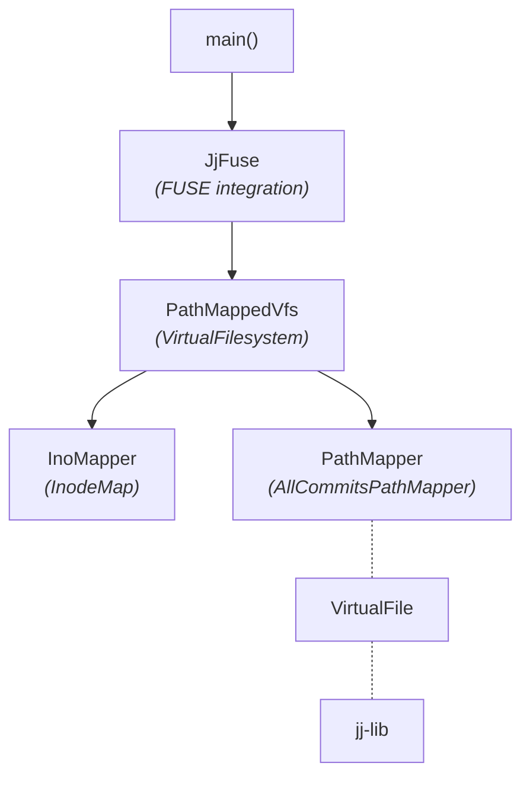
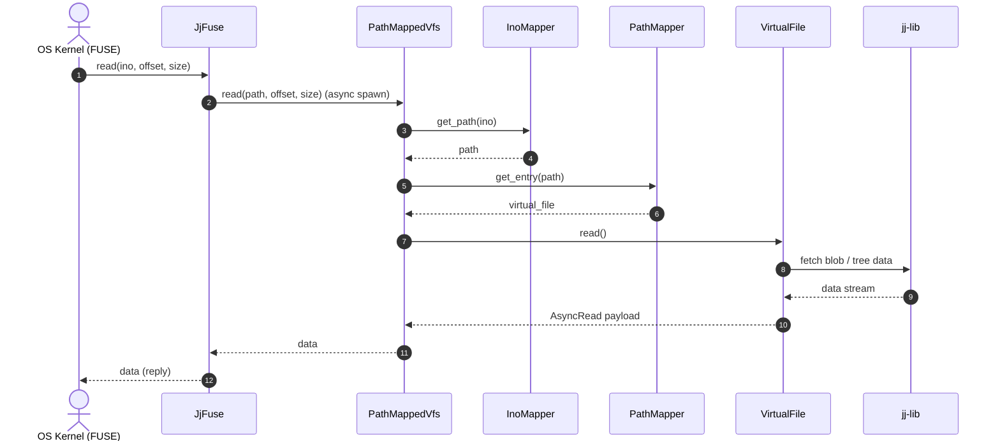

# Jujutsu VFS Design Document

This document describes the architectural design and internal structure of `jjfsd`, a client-side Virtual File System (VFS) for [Jujutsu (`jj`)](https://github.com/jj-vcs/jj) repositories.

---

## Project Description

This project focuses on the client-side implementation of the JJ VFS. The architecture is designed to support both read-only and writable access over a phased roadmap:

- **Phase 1 (Read-Only VFS)**: Core virtual filesystem features enabling browsing of commit trees and bookmarks without checkouts.
- **Phase 2 (JJ Commands in VFS)**: Enabling execution of `jj` CLI commands within the mounted VFS via dynamic `.jj` directory handling and backend integration (e.g. `commit-cloud`).
- **Phase 3 (Writable VFS)**: Live workspace mutation support with working-copy commit rewriting and batched snapshots.

---

## General Structure

The diagram below illustrates the general structs and traits alongside their interactions:



### Components

1. **`main()`**: Daemon entry point. Initializes the Tokio runtime, loads the Jujutsu workspace and repository via `jj-lib`, mounts the FUSE daemon, and listens for POSIX shutdown signals (`SIGINT`, `SIGTERM`, `SIGHUP`).
2. **`JjFuse`**: Endpoint layer implementing `fuser::Filesystem`. Maps FUSE-specific structs and spawns asynchronous tasks onto the Tokio runtime. Because it is decoupled from repository logic, it can be replaced with alternative filesystem endpoints (e.g. NFS).
3. **`VirtualFilesystem` & `PathMappedVfs`**: The middle layer of the architecture. Tracks inode numbers using `InodeMap` and delegates path resolution to `PathMapper`.
4. **`InodeMap` (`InoMapper`)**: Provides bidirectional mapping between 64-bit integer inodes (`Inode`) and filesystem paths. Inodes are generated lazily and remain consistent throughout execution.
5. **`PathMapper` & `AllCommitsPathMapper`**: Defines the mount point layout, mapping paths to `VirtualFile` instances. Additional mappers can be composed to provide custom layouts.
6. **`VirtualFile`**: Trait abstracting any filesystem entity (files, directories, symlinks) and interacting with `jj-lib`.

---

## Request Flow



### Read Request
1. The OS invokes `read(ino, offset, size)` via FUSE.
2. `JjFuse` maps the request arguments and spawns an async task.
3. `PathMappedVfs` resolves `ino` to a `Path` via `InodeMap`.
4. The path is passed to `PathMapper::get_entry()`, which returns a `VirtualFile`.
5. `VirtualFile::read()` returns an `AsyncRead` stream.
6. `PathMappedVfs` reads the payload and returns it to `JjFuse`, which replies to the OS kernel.

Downstream functions return `JjResult<T>` (`Result<T, JjError>`), which `JjFuse` maps to standard POSIX `Errno` codes.

---

## Inode Management (`InodeMap`)

FUSE requires persistent 64-bit inode numbers. `InodeMap` maintains this mapping using a `Mutex<HashMap<Inode, Entry>>`:

```rust
struct Entry {
    parent: Inode,
    name: Ustr,
    children: HashMap<Ustr, Inode>,
}
```

- **Lazy Generation**: Inodes are assigned lazily as the kernel traverses paths via `lookup` or `readdir`.
- **String Interning**: File names use `Ustr` to avoid repetitive heap allocations.
- **Memory Footprint**: In non-directory entries, the child map is currently empty. Wrapping it in an `Option<Box<HashMap<...>>>` can reduce per-file overhead from 48 bytes to an 8-byte pointer (`None`).
- **Concurrency**: While a single `Mutex` is sufficient for current proof-of-concept workloads, highly concurrent workloads could use a sharded arena allocator (e.g. `sharded_slab`) with per-directory mutexes.

---

## Mount Layout & Path Mapping

The default `AllCommitsPathMapper` organizes the repository as follows:

```text
/
├── commits/
│   └── <commit_id>/path/within/commit_tree      # Read-only commit snapshots
└── workspaces/
    └── <workspace_name>/path/within/workspace   # Read-write working copies
```

### `VirtualFile` Variants
- **`ReadonlyCommitTreeFile`**: Reads historical file blobs and trees from `jj-lib`.
- **`WritableCommitTreeFile`**: Writable workspace files with automatic commit updates.
- **`CommitsDirectory`**: Enumerates all commit IDs in the repo.
- **`BookmarksDirectory`**: Enumerates local bookmarks as symlinks.
- **`MutableCommitsDirectory`**: Enumerates non-immutable commits as symlinks.
- **`WorkspacesDirectory`**: Enumerates active workspaces (e.g. `default`).
- **`StaticDirectory`**: Root directory entry listing.

---

## `jj-lib` Backend Constraints & Commit-Cloud

When interacting with standard Git-backed Jujutsu repositories, several constraints arise:
1. **Compressed Git Archives**: Git packs compress file data, preventing true arbitrary byte-offset reads without decompressing preceding bytes.
2. **Directory Offsets**: Directory children cannot be indexed by arbitrary integer offsets, requiring linear scans up to offset $N$.
3. **File Size APIs**: Historical file sizes are not directly exposed in some `jj-lib` paths without streaming the file content.
4. **Timestamps**: Git trees do not store file modification timestamps. Calculating them requires traversing commit history ($O(N)$). Currently, the VFS returns the Unix epoch timestamp.

To address these constraints for large-scale enterprise use, the project is designed to integrate with a dedicated cloud service (**`commit-cloud`**) providing accelerated metadata, range reads, and native timestamps.

---

## Executing JJ Commands within the VFS

The following approaches can be considered to execute `jj` commands within a mounted VFS workspace:

* **Symlink Approach**: Symlink `.jj` inside the workspace root pointing to an underlying physical `.jj` directory. This is the simplest approach but requires a physical .jj directory somewhere within the same filesystem.
* **Dynamic `.jj` Generation**: Serve `.jj` files dynamically via `jj-lib`. This requires raw file format support in `jj-lib` and write support even during read-only `jj` commands.
* **Native VFS Detection**: Modify `jj` upstream to natively detect when it is operating on a `jjfs` mount and connect directly to the daemon or `commit-cloud`.
